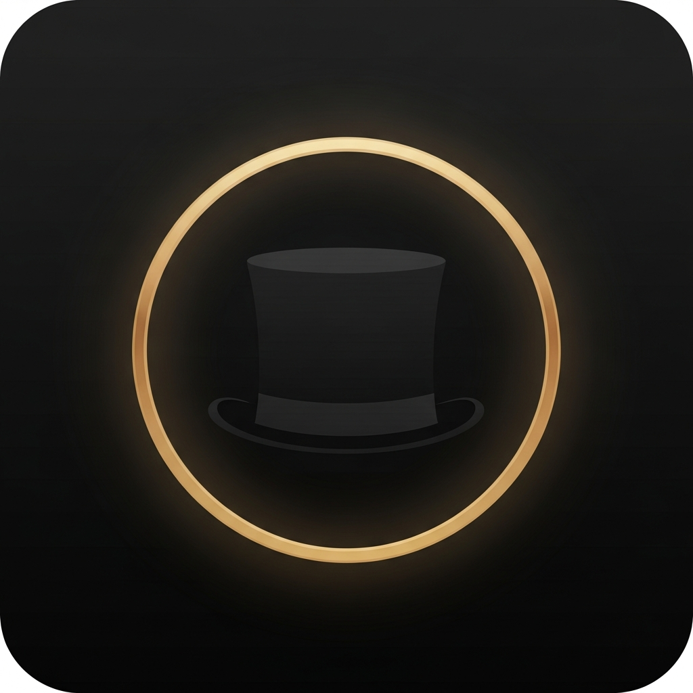

<p align="center">
  
</p>

<h1 align="center">阿福 Alfred</h1>

<p align="center">
  <strong>零介面的語音管家。聊天機器人的反面。</strong>
</p>

<p align="center">
  <a href="README.md"><strong>English</strong></a>
  ·
  <a href="README.zh-TW.md"><strong>繁體中文</strong></a>
</p>

<p align="center">
  <a href="PITCH.md"><strong>產品宣言</strong></a>
  ·
  <a href="ALFRED_SOUL.md"><strong>阿福靈魂</strong></a>
  ·
  <a href="SCENARIOS.md"><strong>情境劇本</strong></a>
  ·
  <a href="HANDOFF.md"><strong>API 文件</strong></a>
  ·
  <a href="ENGINEERING.md"><strong>工程筆記</strong></a>
  ·
  <a href="DEMO_DAY.md"><strong>Demo 手冊</strong></a>
</p>

<p align="center">
  
  
  
  
  
  
</p>

---

## 為什麼不是另一個 AI 助理

過去三年整個科技業都在做同一件事：**把 AI 包成助理**。

ChatGPT、Copilot、Gemini、Claude。每一個都急著告訴你「Hi, how can I help you today?」這是助理 — 它能放大你的工作，但前提是你有時間開口。

**而真正讓人感到被在乎的，是那個在你開口前就替你想好的人。**

```text
助理：「您今天需要我做什麼？」
管家：「主人，您母親今天打了兩次電話沒留言。
       方便的話晚上回個電話。」
```

差別不只是語氣，是**主動性的方向**。

## 阿福是什麼

阿福是一個 iOS 語音管家，背後接 FastAPI server。三條鐵律約束每一個設計決策 — 違反任何一條，這個產品就不再是阿福。

### 第一鐵律：零介面
沒有選單。沒有儀表板。沒有對話流。只有聲音。

只有在主人**必須「看」**的時候才出現介面 — 阿福念給你聽的文件、從相簿叫出的照片、給對面的人看的翻譯大字、或必要的授權頁。**介面本身就是阻力。**

### 第二鐵律：橋梁不是代理
阿福不替主人做決定，他只確保**人對人的關心不因忙碌而斷掉**。

他不會幫您回媽媽的訊息。但他會說：
*「主人，您媽媽三天沒收到您的回覆了。要不要我用您的口吻傳『今晚回去吃飯』給她？」*

### 第三鐵律：永遠先行一步
不等你說「提醒我」。在你需要之前就出現。

## 阿福的一天

**07:15 — 晨間**
> 「主人，太太 7:40 出門開會，記得提醒她帶長傘 — 下午六點之後雷雨。少爺今天國中段考第二天，數學那科他昨晚十一點還在書桌前。早餐我預約的是巷口的蛋餅，您出門前順路。」

**14:32 — 您在公司**
> 「主人，洗衣機剛剛預約洗完了。冰箱牛奶剩半罐，我幫您加進今晚回家路上的清單了。母親大人下午三點來電一次，沒留言，是不是該回個電話？」

**18:50 — 晚間**
> 「主人，您今天從早上 9:12 到現在 18:50 沒坐下超過 20 分鐘，提醒一下。少爺已經到家了，但他從進門到現在沒講過一句話 — 主人，他段考應該不順。」

→ 完整情境：[SCENARIOS.md](SCENARIOS.md)

## 系統架構

```
   ┌──────────────┐          ┌─────────────────────┐         ┌──────────────────┐
   │  iOS 用戶端  │   語音   │  Alfred backend     │  LLM    │  Gemini · Claude │
   │  (Swift)     │ ───────► │  (FastAPI · Python) │ ──────► │  OpenAI          │
   │              │          │                     │         └──────────────────┘
   │  · Whisper   │          │  · JWT (HS256)      │         ┌──────────────────┐
   │  · ElevenLabs│ ◄─────── │  · 每人獨立 SQLite  │  TTS    │  ElevenLabs      │
   │  · 環境錄音  │   音訊   │  · 背景 worker      │ ──────► │  (clone 聲音)    │
   │              │          │  · Action gate      │         └──────────────────┘
   └──────────────┘          │  · Vault 加密       │
                             └──────────┬──────────┘
                                        │
                            ┌───────────┴────────────┐
                            ▼                        ▼
                    Google Calendar          LINE · Telegram
                    Gmail · Drive            Twilio 語音
                    家庭定位                 HealthKit
```

**關鍵技術選擇**

- **語音優先**：Whisper STT + ElevenLabs cloned voice，沒有 chat 滾動介面
- **背景認知**：環境錄音（120 秒 chunk）、位置 worker、提醒輪詢
- **Action gate**：不可逆操作（傳送、付款、公開、刪除）必須經過主人確認
- **使用者隔離**：每個 user 有自己的 SQLite vault
- **後端 crash-resilient**：`systemd` 自動 restart、SIGHUP-safe

技術細節：[ENGINEERING.md](ENGINEERING.md) · [HANDOFF.md](HANDOFF.md)

## Repo 結構

```
alfred-butler/
├── Alfred/                      iOS Swift 程式碼（現役）
│   ├── Core/                    ViewModel、API、音訊、環境錄音、相片、定位
│   ├── Features/                Chat、Auth、Photos、Office、Family、Translate
│   └── Resources/               voice_bank/、manifest、開機音訊
├── Alfred.xcodeproj
├── backend/                     FastAPI server
│   ├── main.py                  HTTP routes、對話協調
│   ├── gcal_service.py          Google Calendar / Gmail / Drive
│   ├── line_service.py
│   ├── call_service.py          Twilio 語音
│   ├── indexer/                 檔案／文件索引（給 retrieval 用）
│   ├── scrapers/                電商比價 agent
│   └── .env.example             環境變數範本
├── frontend/                    Web PWA + admin
└── scripts/                     e2e test、備份
```

## 快速開始

> 後端跟 iOS app 分開跑。你需要一台自己的 VPS 跟 Xcode。

**後端（Python 3.11+）**

```bash
cd backend
cp .env.example .env
# 填上你自己的 API keys（Google、OpenAI、ElevenLabs、LINE、Twilio...）
pip install -r requirements.txt
python main.py            # bind 在 0.0.0.0:9001
```

**iOS app**

```bash
open Alfred.xcodeproj
# 編輯 Alfred/Core/*.swift → 把 YOUR_BACKEND_HOST 換成你後端的 URL
# 在 target signing 設你的 Apple Developer team ID
# Build 到實機（麥克風、AVAudioSession 需要真機才能測）
```

## 目前狀態

公開技術預覽版。後端穩定；iOS 用戶端在私人 TestFlight。

## 授權

請看 [LICENSE](LICENSE)。

## Credits

由 [@norika1207-lab](https://github.com/norika1207-lab) 帶領一個人 + 一支 AI agent 艦隊一起做。姊妹專案：

- [**afu-brain**](https://github.com/norika1207-lab/afu-brain) — 阿福路由經過的安全閘門與記憶層
- [**alfred-system**](https://github.com/norika1207-lab/alfred-system) — 更廣的 personal-AI 架構參考
